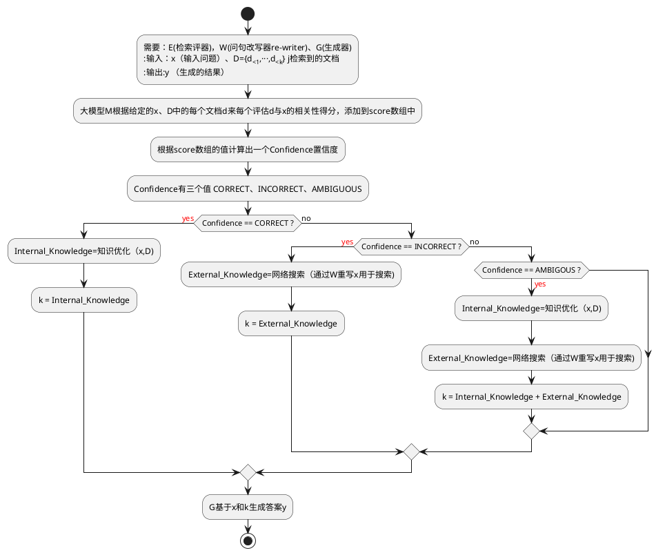

[论文地址](https://arxiv.org/abs/2401.15884) 

Corrective RAG(纠错检索增强生成)（CRAG）是一种旨在增强语言模型生成稳健性的方法，它通过评估器和大规模网络搜索对检索文档的相关性进行评估和增强，确保在生成过程中使用更准确、更可靠的信息。

还是从一个常见的场景开始：参加开卷考试。通常，我们有三种策略：

- 方法 1：快速回答熟悉的题目。对于不熟悉的题目，可参考参考书。快速找到相关章节，在头脑中进行整理和归纳，然后将答案写在试卷上。
- -方法 2：针对每个题目，参考书目。找出相关章节，在脑海中进行总结，然后将答案写在试卷上。
- 方法 3：针对每个主题，查阅本书并确定相关章节。在形成观点之前，将收集到的信息分为三类： **Correct** 、 **Incorrect** 和 **Ambiguous** 。分别处理每一类信息。然后，根据这些处理过的信息，在头脑中进行梳理和总结。将你的回答写在试卷上。

方法 1 涉及了Self-RAG，而方法 2 则是传统的 RAG 流程。而方法 3则是体现了CRAG即[Corrective Retrieval Augmented Generation (CRAG)](https://arxiv.org/pdf/2401.15884.pdf)流程。


图 1：这些例子表明，低质量的检索器容易引入大量无关信息，阻碍生成器获得准确的知识，从而产生误导和幻觉。

这篇论文主要是**解决检索质量不高导致生成文本错误和幻觉的问题**，论文的核心是设计一个检索评估器来评估检索文档质量，并根据评估结果触发不同的**知识检索动作**，包括【正确 **Correct** 、错误 **Incorrect**和模糊**Ambiguous**】。对于正确的检索文档，CRAG会进行**知识精炼**，抽取关键信息并过滤掉无关信息。对于错误的检索文档，CRAG会利用**网络搜索**来寻找更多的知识来源。对于模糊的检索文档，CRAG会结合两种动作，以提高检索的**鲁棒性和正确性**。


纠正性 RAG（CRAG）引入了一些有趣的想法：

- 采用轻量级检索评估器来评估检索到的文档与输入内容的相关性，并为每个文档返回一个置信度分数。
	- CRAG 采用轻量级的 T5-large 模型为基础模型进行微调训练作为检索评估器。值得注意的是，在大型语言模型时代，T5-large 也被认为是轻量级的。它相比当前最新的大型语言模型更为小巧，拥有较小的参数规模。这意味着它可以更快捷高效地执行评估任务，并降低计算成本。
- 如果向量存储检索的结果被认为模棱两可或与用户查询无关，则执行基于网络的文档检索以补充上下文。
- 将检索到的文档切分为 "知识条（knowledge strips）"，对每条进行分级，并过滤不相关的片段，从而对检索到的文档进行知识提炼（**knowledge refinement** ）。
	- 果检索到的文档仅由一两个句子组成，则将其视为一个独立单元。否则，文档会被分割成更小的单元，通常由几个句子组成，具体取决于总长度。每个单元都应包含一条独立的信息。
	- 检索评价器会用来计算每个知识条的相关性得分。相关性得分低的知识条带会被过滤掉。然后将剩余的相关知识条重新组合，形成内部知识。


- 如果为 **correct** ，则意味着检索到的文档包含查询所需的内容，然后采用知识细化算法对检索到的文档进行重写。
- 如果检索到的文档是 **incorrect** ，这意味着查询和检索到的文档是不相关的。因此，我们不能将文档发送到 LLM 。在 CRAG 中，我们使用网络搜索引擎来检索外部知识。
- 对于 **ambiguous** 情况，这意味着检索到的文件可能接近但不足以提供答案。在这种情况下，就需要通过网络搜索来获取更多信息。因此，需要同时使用知识提炼算法和搜索引擎。
- 最后，经过处理的信息被转发到 LLM 生成回复。



触发上述分支动作的两个置信度阈值是根据经验设定的。具体来说，在 PopQA 中，它们被设定为（0.59, -0.99）；在 PubQA 和 ArcChallenge 中，它们被设定为（0.5, -0.91）；在 Biography 中，它们被设定为（0.95, -0.91）。

## 改进检索评估器

检索评估器可以看作是一个评分分类模型。该模型用于确定查询和文档的相关性，类似于 RAG 中的re-ranking模型。

这种相关性判断模型可以通过整合更多符合现实世界场景的特征来加以改进。例如，科学论文问答RAG 包含许多专业术语，而旅游领域的 RAG 则往往包含更多口语化的用户查询。

通过在检索评估器的训练数据中添加场景特征，它可以更好地评估检索文档的相关性。如图 6 所示，还可以加入用户意图和编辑距离等其他特征：


此外，考虑到 T5-Large 所取得的成果，轻量级模型似乎也能取得良好的成果。这为 CRAG 在小规模团队或公司中的应用带来了希望。

## 检索评价器的分数和阈值

 如前所述，不同类型数据的阈值是不同的。此外，我们还可以发现 `**ambiguous**` 和 `**incorrect**` 的阈值基本上都在-0.9 左右，这表明大部分检索到的知识都与查询相关。完全摒弃这些检索到的知识而完全依赖网络搜索可能并不可取。
 
CRAG的检索评估器通过综合分析和智能判断检索文档的相关性和可靠性，实现了对检索结果的实时评估和自动纠正，提高了整个生成系统的稳定性和准确性。但需要注意的是，构建这样一个评估器还需要进行微调以适应不同的RAG框架，同时也要警惕由网络搜索引入的潜在偏差，因为互联网资源质量参差不齐，未经充分筛选的数据可能会引入噪声或误导性信息。


在实际应用中，我们需要根据实际问题和需求进行调整。

## CRAG与Self-RAG的区别

- 从流程的角度来看，Self-RAG 可以使用 LLM 直接提供响应，而无需检索，而 CRAG 则必须在添加评估层之前进行检索。
- 从结构上看，self-RAG 比 CRAG 更复杂，它需要更复杂的训练过程，并且在生成阶段需要生成和评估多个标签，这不可避免地增加了推理成本。因此，CRAG 比 selfRAG 更轻便。
- 从性能上看，如图 5 所示，在大多数情况下，CRAG 通常优于自 RAG。


参考实现：
 
[官方实现](https://github.com/DeEnabler/CRAG)
[langchain版CRAG](https://github.com/langchain-ai/langgraph/blob/main/examples/rag/langgraph_crag.ipynb)
langchain通过langgraph来实现了CRAG，可以通过下图来理解，但该实现对CRAG做了一些简化和调整（当然，也可以根据需要进行定制和扩展）：

- 作为第一道工序，跳过知识提炼阶段。它是一种有趣而有价值的后处理形式，但对于理解如何在 LangGraph 中布局这一工作流程并不重要。
- 如果所有文档都不相关，则通过网络搜索进行补充检索。它们将使用 [Tavily Search](https://python.langchain.com/docs/integrations/tools/tavily_search?ref=blog.langchain.dev) API 进行[网络搜索](https://tavily.com/?ref=blog.langchain.dev)，它既快速又方便。
- 使用查询重写(re-write query)来优化网络搜索查询。
- 对于分支决策，使用 Pydantic 对输出进行建模，并将该函数作为 OpenAI 工具提供，每次 LLM 运行时都会调用该函数。这样，我们就能为条件边的输出建模，因为在这种情况下，分支逻辑的一致性至关重要。
这个实现也是体现RAG Flow，体现 RAG 的 "流程工程（flow engineering） "的例子，包括特定的决策点（如文档分级）和循环（如重试检索）。

[llamaindex版CRAG](https://github.com/run-llama/llama_index/tree/main/llama-index-packs/llama-index-packs-corrective-rag)


```python
class CorrectiveRAGPack(BaseLlamaPack):  
...  
...  
def run(self, query_str: str, **kwargs: Any) -> Any:  
"""Run the pipeline."""  
# 根据输入查询语句检索文档.  
retrieved_nodes = self.retrieve_nodes(query_str, **kwargs)  
  
# 评估每条检索到的文档与查询语句之间的相关度 
relevancy_results = self.evaluate_relevancy(retrieved_nodes, query_str)  
# Extract texts from documents that are deemed relevant based on the evaluation.  
# 根据评估结果提取文档中确实相关的文本
relevant_text = self.extract_relevant_texts(retrieved_nodes, relevancy_results)  
  
# Initialize search_text variable to handle cases where it might not get defined.  
search_text = ""  
  
# If any document is found irrelevant, transform the query string for better search results.  
if "no" in relevancy_results:  
transformed_query_str = self.transform_query_pipeline.run(  
query_str=query_str  
).message.content  
# Conduct a search with the transformed query string and collect the results.  
search_text = self.search_with_transformed_query(transformed_query_str)  
  
# Compile the final result. If there's additional search text from the transformed query,  
# it's included; otherwise, only the relevant text from the initial retrieval is returned.  
if search_text:  
return self.get_result(relevant_text, search_text, query_str)  
else:  
return self.get_result(relevant_text, "", query_str)
```

上述代码与标准 CRAG 流程有三个主要区别：

- 没有对 `**ambiguous**` 文件进行判断或处理。
- 它没有使用训练有素的 T5-large 模型，而是利用 LLM 来评估检索到的信息。按照CRAG 论文显示，ChatGPT 在识别检索相关性方面的性能不如 T5-Large 高。
- 跳过了知识提炼的过程。原始的知识提炼算法可参考相关代码(https://github.com/HuskyInSalt/CRAG/blob/main/scripts/internal_knowledge_preparation.py#L58)。

尽管存在这些差异，但 LlamaIndex 提供的是一种思维方式（langchain 也是如此）。


参考文档：
[Advanced RAG 11: Query Classification and Refinement](https://webcache.googleusercontent.com/search?q=cache:https%3A%2F%2Fai.gopubby.com%2Fadvanced-rag-11-query-classification-and-refinement-2aec79f4140b)
[# Advanced RAG 10: Corrective Retrieval Augmented Generation (CRAG)](https://webcache.googleusercontent.com/search?q=cache:https%3A%2F%2Fai.gopubby.com%2Fadvanced-rag-10-corrective-retrieval-augmented-generation-crag-3f5a140796f9)
[【LLM-RAG】纠正性检索增强生成](https://zhuanlan.zhihu.com/p/681186898)
