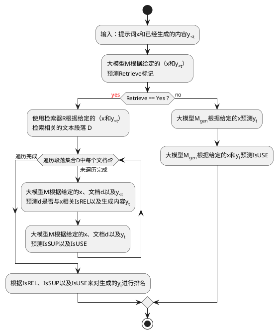
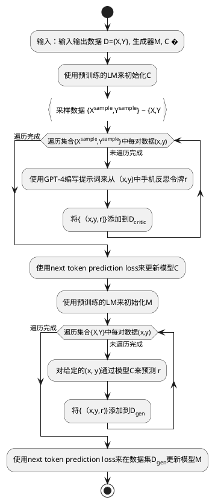

论文链接：[https://arxiv.org/abs/2310.11511](https://arxiv.org/abs/2310.11511)

项目主页：[https://selfrag.github.io/](https://selfrag.github.io/)

**问题：事实不准确的通用大语言模型   

 
尽管大型语言模型（LLMs）具有非凡的能力，但由于它们完全依赖于其封装的参数知识，因此经常会产生包含不准确事实的回复。它们经常会产生幻觉，尤其是在长尾情况下，它们的知识会过时，并且缺乏明确的来源或引用。

**RAG是灵丹妙药吗？**  

检索增强生成（RAG）是一种通过检索相关知识来增强 LM 的方法，可以减少此类问题，并在QA问答等知识密集型任务中显示出有效性。然而，不加区分地检索和纳入固定数量的检索段落，而不管检索是否必要或段落是否相关，会降低 LM 的通用性，或导致生成没有帮助的响应。此外，也无法保证保证生成的内容一定来源于引用的证据。

**什么是 Self-RAG？**  

自我反思（Self-Reflective）检索增强生成（Self-RAG）是一个通过检索和自我反思提高 LM 质量和真实性的新框架。这个框架会训练一个任意的 LM，这个 LM 可按需灵活地检索段落（例如，可在生成过程中多次检索，或完全跳过检索），生成内容，并使用特殊标记（称为反思标记**reflection token**）生对检索到的段落及其自己生成的内容进行反思。生成反思标记使 LM 在推理阶段具有可控性，使其能够根据不同的任务要求调整自己的行为。

图1 
**Self-RAG 有多厉害？**  

实验表明，Self-RAG（7B 和 13B 参数）在各种任务中的表现明显优于最先进的 LLMs 和检索增强模型。具体来说，在开放域QA问答、推理和事实验证任务上，Self-RAG 的表现优于 ChatGPT 和检索增强的 Llama2-chat，而且与这些模型相比，Self-RAG在改善长篇内容生成的真实性和引文准确性方面也有显著提升。

Self-RAG：学会检索、生成和批判

Self-RAG 是一个新的框架，它通过自我反思标记（**Self-reflection tokens**）来训练和控制任意的 LM。具体来说，在每个片段（如句子），Self-RAG 可以

检索：Self-RAG 首先解码出一个检索标记（**retrieval token**），以评估检索的有效性并控制检索组件。如果需要检索，LM 会调用外部检索模块，利用输入查询和上一次生成的信息，查找最相关的文档。

生成：如果不需要检索，模型就会像常规的 LM那样预测下一个输出片段。如果需要检索，模型首先会生成评估标记（ **critique token**），评估检索到的文档是否相关，然后根据检索到的段落生成后续内容。

评估（**Critique**）：如果需要检索，模型会进一步评估段落内容是否支持生成结果。最后，一个新的评估标记（ **critique token**）会评估回复的整体效用。

形式上，给定输入x 后，我们训练 ℳ 依次生成由多个片段 y=[y1,…,yT] 组成的文本输出 y ，其中 ,yT 表示第T个片段的标记序列。 一个片段一般对应一个句子。
下面列出的是在训练过程中用到的几种不同类型的反思标记（**reflection token）。

| 标记类型     | 输入    | 输出                                                        | 定义                                                                        |
| -------- | ----- | --------------------------------------------------------- | ------------------------------------------------------------------------- |
| Retrieve | xlx,y | yes,   no,   continue                                     | 根据输入的问题x 或者问题x以及前面生成的内容y 来 决定是否使用检索器R来进行检索  ,continue的值表示模型可以继续使用之前检索到的证据 |
| ISREL    | x,d   | **relevant**,   irrelevant                                | 检索到的文档d是否提供了有助于解决问题x的有关信息                                                 |
| ISSUP    | x,d,y | **fully supported**,   partially supported,    no support | 生成的内容y中所有需要进一步核实的信息是否都在文档d中有相应的支持。                                        |
| ISUSE    | x,y   | **5**,  4,  3,  2,  1                                     | 对于问题x，生成的答复内容y是有用的回复                                                      |
Self-RAG中共有4种反思标记（reflection token），大致分为Retrieve和Critique两大类。其中Critique标记又分为IsREL、IsSUP、IsUSE三小类，其中粗体表示某类token最期望的取值。

算法1 

### Self-RAG 推理过程

### 推理概述。
图 1 和算法 1 展示了推理中的 Self-Rag 概述。

对于每一个 x和 已经生成的内容y&lt;t ,模型都会解码一个检索标记(retrieval token)，以评估检索的有效性。如果不需要检索，模型就会像标准 LM 那样预测下一个输出片段。如果需要检索，模型就会生成：1、一个评论标记来评估检索段落的相关性、2、下一个响应片段，以及3、一个评论标记来评估响应片段中的信息是否得到所检索的段落的支持。最后，一个新的评论标记会评估回复的整体有效性。 

为了生成每个片段，Self-Rag 会并行处理多个段落，并使用自己生成的反思标记（reflection token）对生成的任务输出执行宽松约束(soft constraints )或严格控制(hard control)（算法 1）。例如，在图 1（右图）中，由于 d2 没有提供直接证据（不相关），且 d3 的输出只有部分支持，而 d1 的输出则完全支持，因此在第一个时间步骤中选择了检索到的段落d1 。

通过生成反思标记（reflection token）来自我评估输出结果，Self-RAG可以在推理阶段进行控制，从而使其行为适应不同的任务要求。对于事实准确性要求高的任务，目标则是让模型更频繁地检索段落，以确保输出结果与现有证据密切吻合。相反，在开放性较强的任务中，如撰写个人经历文章，重点则转向减少检索次数，优先考虑整体创造性或实用性得分。

**带检索标记（ retrieval token）和阈值的的自适应检索**：先前的工作通常在生成过程中固定时间检索段落（例如，只在开始时检索，或者每隔 k 个令牌检索一次），难以在质量和效率之间取得平衡。在 Self-RAG 学习生成检索标记以灵活检索的同时，人们还可以利用检索标记的token概率，根据其软约束条件改变检索频率。
带阈值的自适应检索。Self-Rag 通过预测检索标记（Retrive token）来动态决定何时检索文本段落。此外，该框架还允许设置阈值。具体来说，如果在所有Retrive输出标记中产生=Yes标记的概率超过了指定的阈值，我们就会触发检索。

**带有评估标记（critique token）的树状解码**：Self-RAG 引入了多个细粒度的评估标记，对生成内容的质量从不同方面（如证据支持性、完整性）进行评估。我们使用理想评估标记概率的线性内插法进行分段级波束搜索( beam search)，以在每个时间段内确定 K 个最佳连续句。

 在每个分段步骤 t 中，当需要根据严格条件或宽松条件（soft condition）进行检索时， ℛ 会检索K 个段落，生成器 ℳ 会并行处理每个段落，并输出K 个不同的候选后续片段。我们进行分段级波束搜索（beam search）（beam size=B ），以获得每个时间戳t的前B 段连续序列，并在生成结束时返回最佳序列。每个片段 yt 相对于段落d的得分会用评估者得分 𝒮 更新，该得分是每种标记类型的归一化概率的线性加权和。对于每个评估标记组 G （例如IsREL），我们将其在时间戳 t的得分记为 StG ，并按如下方式计算段落得分：
  

在时间步t时，G的得分为  <math xmlns="http://www.w3.org/1998/Math/MathML"><msubsup><mi>s</mi><mi>t</mi><mrow class="MJX-TeXAtom-ORD"><mi>G</mi></mrow></msubsup><mo>=</mo><mfrac><mrow><msub><mi>p</mi><mi>t</mi></msub><mo stretchy="false">(</mo><mrow class="MJX-TeXAtom-ORD"><mover><mi>r</mi><mo stretchy="false">^</mo></mover></mrow><mo stretchy="false">)</mo></mrow><mrow><mrow class="MJX-TeXAtom-ORD"><mstyle displaystyle="false" scriptlevel="0"><munderover><mo>∑</mo><mrow class="MJX-TeXAtom-ORD"><mi>i</mi><mo>=</mo><mn>1</mn></mrow><mrow class="MJX-TeXAtom-ORD"><msup><mi>N</mi><mi>G</mi></msup></mrow></munderover></mstyle></mrow><mtext>&nbsp;</mtext><mtext>&nbsp;</mtext><msub><mi>p</mi><mi>t</mi></msub><mo stretchy="false">(</mo><msub><mi>r</mi><mi>i</mi></msub><mo stretchy="false">)</mo></mrow></mfrac></math> ，代表最期望的反思标记 <math xmlns="http://www.w3.org/1998/Math/MathML"><mrow class="MJX-TeXAtom-ORD"><mover><mi>r</mi><mo stretchy="false">^</mo></mover></mrow></math> 相对有  NG个不同取值的评估标记类型 G的概率值。公式中的 wG权重 是超参数，可以在推理时进行调整 以便在测试时实现自定义行为。为了确保结果 y得到大部分证据的支持，可给IsSUP较高的权重，而给其他标记较低的权重，这是软性控制行为。通过在解码环节设置评估器critique，我们也可以施加硬性约束。我们可以不使用公式中的软奖励函数，而是在模型生成不良标记（比如IsSUP=No support）时，就明确过滤掉一个候选的后续片段。在 RLHF（Touvron 等人，2023 年；Wu 等人，2023 年）中已经对平衡多种偏好之间的权衡进行了研究，这通常需要通过训练来改变模型的行为。Self-RAG 不需要额外的训练就能定制 LM。

### 训练概述。
Self-RAG可使任意 LM 生成带有反思标记（reflection token）的文本，方法是将它们统一为扩展模型词汇（即原始词汇加上反思标记（reflection token））的下一个token预测。具体来说，我们在一个经过设计的语料库上训练生成器模型 ℳ ，该语料库包含由检索器 ℛ 检索到的段落和由评估模型 𝒞 预测的反思标记交替出现（总结见附录算法 2）。我们训练 𝒞 生成反思标记，用于评估检索到的段落和给定任务输出的质量。利用评估模型，我们通过在离线任务输出中插入反思标记来更新训练语料库。随后，我们使用传统的 LM 目标训练最终生成模型（ ℳ ），使 ℳ 能够在推理时不依赖评估模型而自行生成反思标记。
### Self-RAG 训练

Self-RAG 训练包括两种模型：**Critic**和**Generator**。

#### 训练评估者模型 𝒞

##### 评估模型的数据收集
对每个片段的反思标记进行人工标注的成本很高（Wu 等人，2023 年）。GPT-4（OpenAI，2023 年）等最先进的 LLM 可以有效地生成此类反馈（刘等人，2023b）。然而，依赖这种专有的 LM 会提高 API 成本，降低可重复性（陈等人，2023 年）。我们通过提示 GPT-4 生成反思标记来创建监督数据，然后将其知识提炼为内部 𝒞 。对于每组反思标记，我们从原始训练数据中随机抽取实例： {Xsample,Ysample}∼{X,Y} 。如表 1 所示，不同的反思令牌组有各自的定义和输入，因此我们对它们使用不同的指令提示。在此，我们以 GPT-4 为例。我们向 GPT-4 发送了一条特定类型的指令（Given an instruction, make a judgment on whether finding some external documents from the web helps to generate a better response.）（"给定指令，请判断从网络上查找一些外部文档是否有助于生成更好的回复。"），然后通过小样本示范 I、 原始任务输入 x 和输出 y 来预测一个合适的反思标记文本：p​( r | I, x, y ) 。人工评估结果表明，GPT-4 的反思标记预测与人工评估结果具有很高的一致性。我们为每种类型收集了 4k-20k 个有监督的训练数据，并将它们组合起来形成 𝒞 的训练数据。

##### 评估模型学习

在收集到训练数据𝒟critic,之后，我们用预先训练好的 LM 对 𝒞 进行初始化，并使用标准的条件语言建模目标（最大化可能性）对𝒟critic,进行训练：
<math id="S3.E1.m1.8" class="ltx_Math" alttext="\max_{\mathcal{C}}\mathbb{E}_{((x,y),r)\sim\mathcal{D}_{critic}}\log p_{\mathcal{C}}(r|x,y),\text{
$r$ for reflection tokens. }" display="block" data-immersive-translate-walked="5e3f0c2a-bd88-474c-8a00-d3c282db2004"><semantics id="S3.E1.m1.8a"><mrow id="S3.E1.m1.8.8.1" xref="S3.E1.m1.8.8.2.cmml"><mrow id="S3.E1.m1.8.8.1.1" xref="S3.E1.m1.8.8.1.1.cmml"><mrow id="S3.E1.m1.8.8.1.1.3" xref="S3.E1.m1.8.8.1.1.3.cmml"><munder id="S3.E1.m1.8.8.1.1.3.1" xref="S3.E1.m1.8.8.1.1.3.1.cmml"><mi id="S3.E1.m1.8.8.1.1.3.1.2" xref="S3.E1.m1.8.8.1.1.3.1.2.cmml">max</mi><mi class="ltx_font_mathcaligraphic" id="S3.E1.m1.8.8.1.1.3.1.3" xref="S3.E1.m1.8.8.1.1.3.1.3.cmml">𝒞</mi></munder><mo lspace="0.167em" id="S3.E1.m1.8.8.1.1.3a" xref="S3.E1.m1.8.8.1.1.3.cmml">⁡</mo><mrow id="S3.E1.m1.8.8.1.1.3.2" xref="S3.E1.m1.8.8.1.1.3.2.cmml"><msub id="S3.E1.m1.8.8.1.1.3.2.2" xref="S3.E1.m1.8.8.1.1.3.2.2.cmml"><mi id="S3.E1.m1.8.8.1.1.3.2.2.2" xref="S3.E1.m1.8.8.1.1.3.2.2.2.cmml">𝔼</mi><mrow id="S3.E1.m1.5.5.4" xref="S3.E1.m1.5.5.4.cmml"><mrow id="S3.E1.m1.5.5.4.4.1" xref="S3.E1.m1.5.5.4.4.2.cmml"><mo stretchy="false" id="S3.E1.m1.5.5.4.4.1.2" xref="S3.E1.m1.5.5.4.4.2.cmml">(</mo><mrow id="S3.E1.m1.5.5.4.4.1.1.2" xref="S3.E1.m1.5.5.4.4.1.1.1.cmml"><mo stretchy="false" id="S3.E1.m1.5.5.4.4.1.1.2.1" xref="S3.E1.m1.5.5.4.4.1.1.1.cmml">(</mo><mi id="S3.E1.m1.2.2.1.1" xref="S3.E1.m1.2.2.1.1.cmml">x</mi><mo id="S3.E1.m1.5.5.4.4.1.1.2.2" xref="S3.E1.m1.5.5.4.4.1.1.1.cmml">,</mo><mi id="S3.E1.m1.3.3.2.2" xref="S3.E1.m1.3.3.2.2.cmml">y</mi><mo stretchy="false" id="S3.E1.m1.5.5.4.4.1.1.2.3" xref="S3.E1.m1.5.5.4.4.1.1.1.cmml">)</mo></mrow><mo id="S3.E1.m1.5.5.4.4.1.3" xref="S3.E1.m1.5.5.4.4.2.cmml">,</mo><mi id="S3.E1.m1.4.4.3.3" xref="S3.E1.m1.4.4.3.3.cmml">r</mi><mo stretchy="false" id="S3.E1.m1.5.5.4.4.1.4" xref="S3.E1.m1.5.5.4.4.2.cmml">)</mo></mrow><mo id="S3.E1.m1.5.5.4.5" xref="S3.E1.m1.5.5.4.5.cmml">∼</mo><msub id="S3.E1.m1.5.5.4.6" xref="S3.E1.m1.5.5.4.6.cmml"><mi class="ltx_font_mathcaligraphic" id="S3.E1.m1.5.5.4.6.2" xref="S3.E1.m1.5.5.4.6.2.cmml">𝒟</mi><mrow id="S3.E1.m1.5.5.4.6.3" xref="S3.E1.m1.5.5.4.6.3.cmml"><mi id="S3.E1.m1.5.5.4.6.3.2" xref="S3.E1.m1.5.5.4.6.3.2.cmml">c</mi><mo lspace="0em" rspace="0em" id="S3.E1.m1.5.5.4.6.3.1" xref="S3.E1.m1.5.5.4.6.3.1.cmml">​</mo><mi id="S3.E1.m1.5.5.4.6.3.3" xref="S3.E1.m1.5.5.4.6.3.3.cmml">r</mi><mo lspace="0em" rspace="0em" id="S3.E1.m1.5.5.4.6.3.1a" xref="S3.E1.m1.5.5.4.6.3.1.cmml">​</mo><mi id="S3.E1.m1.5.5.4.6.3.4" xref="S3.E1.m1.5.5.4.6.3.4.cmml">i</mi><mo lspace="0em" rspace="0em" id="S3.E1.m1.5.5.4.6.3.1b" xref="S3.E1.m1.5.5.4.6.3.1.cmml">​</mo><mi id="S3.E1.m1.5.5.4.6.3.5" xref="S3.E1.m1.5.5.4.6.3.5.cmml">t</mi><mo lspace="0em" rspace="0em" id="S3.E1.m1.5.5.4.6.3.1c" xref="S3.E1.m1.5.5.4.6.3.1.cmml">​</mo><mi id="S3.E1.m1.5.5.4.6.3.6" xref="S3.E1.m1.5.5.4.6.3.6.cmml">i</mi><mo lspace="0em" rspace="0em" id="S3.E1.m1.5.5.4.6.3.1d" xref="S3.E1.m1.5.5.4.6.3.1.cmml">​</mo><mi id="S3.E1.m1.5.5.4.6.3.7" xref="S3.E1.m1.5.5.4.6.3.7.cmml">c</mi></mrow></msub></mrow></msub><mo lspace="0.167em" rspace="0em" id="S3.E1.m1.8.8.1.1.3.2.1" xref="S3.E1.m1.8.8.1.1.3.2.1.cmml">​</mo><mrow id="S3.E1.m1.8.8.1.1.3.2.3" xref="S3.E1.m1.8.8.1.1.3.2.3.cmml"><mi id="S3.E1.m1.8.8.1.1.3.2.3.1" xref="S3.E1.m1.8.8.1.1.3.2.3.1.cmml">log</mi><mo lspace="0.167em" id="S3.E1.m1.8.8.1.1.3.2.3a" xref="S3.E1.m1.8.8.1.1.3.2.3.cmml">⁡</mo><msub id="S3.E1.m1.8.8.1.1.3.2.3.2" xref="S3.E1.m1.8.8.1.1.3.2.3.2.cmml"><mi id="S3.E1.m1.8.8.1.1.3.2.3.2.2" xref="S3.E1.m1.8.8.1.1.3.2.3.2.2.cmml">p</mi><mi class="ltx_font_mathcaligraphic" id="S3.E1.m1.8.8.1.1.3.2.3.2.3" xref="S3.E1.m1.8.8.1.1.3.2.3.2.3.cmml">𝒞</mi></msub></mrow></mrow></mrow><mo lspace="0em" rspace="0em" id="S3.E1.m1.8.8.1.1.2" xref="S3.E1.m1.8.8.1.1.2.cmml">​</mo><mrow id="S3.E1.m1.8.8.1.1.1.1" xref="S3.E1.m1.8.8.1.1.1.1.1.cmml"><mo stretchy="false" id="S3.E1.m1.8.8.1.1.1.1.2" xref="S3.E1.m1.8.8.1.1.1.1.1.cmml">(</mo><mrow id="S3.E1.m1.8.8.1.1.1.1.1" xref="S3.E1.m1.8.8.1.1.1.1.1.cmml"><mi id="S3.E1.m1.8.8.1.1.1.1.1.2" xref="S3.E1.m1.8.8.1.1.1.1.1.2.cmml">r</mi><mo fence="false" id="S3.E1.m1.8.8.1.1.1.1.1.1" xref="S3.E1.m1.8.8.1.1.1.1.1.1.cmml">|</mo><mrow id="S3.E1.m1.8.8.1.1.1.1.1.3.2" xref="S3.E1.m1.8.8.1.1.1.1.1.3.1.cmml"><mi id="S3.E1.m1.6.6" xref="S3.E1.m1.6.6.cmml">x</mi><mo id="S3.E1.m1.8.8.1.1.1.1.1.3.2.1" xref="S3.E1.m1.8.8.1.1.1.1.1.3.1.cmml">,</mo><mi id="S3.E1.m1.7.7" xref="S3.E1.m1.7.7.cmml">y</mi></mrow></mrow><mo stretchy="false" id="S3.E1.m1.8.8.1.1.1.1.3" xref="S3.E1.m1.8.8.1.1.1.1.1.cmml">)</mo></mrow></mrow><mo id="S3.E1.m1.8.8.1.2" xref="S3.E1.m1.8.8.2.cmml">,</mo><mrow id="S3.E1.m1.1.1.1" xref="S3.E1.m1.1.1.1c.cmml"><mtext id="S3.E1.m1.1.1.1a" xref="S3.E1.m1.1.1.1c.cmml">&nbsp;</mtext><mi id="S3.E1.m1.1.1.1.m1.1.1" xref="S3.E1.m1.1.1.1.m1.1.1.cmml">r</mi><mtext id="S3.E1.m1.1.1.1b" xref="S3.E1.m1.1.1.1c.cmml">&nbsp;for reflection tokens.&nbsp;</mtext></mrow></mrow><annotation-xml encoding="MathML-Content" id="S3.E1.m1.8b"><list id="S3.E1.m1.8.8.2.cmml" xref="S3.E1.m1.8.8.1"><apply id="S3.E1.m1.8.8.1.1.cmml" xref="S3.E1.m1.8.8.1.1"><times id="S3.E1.m1.8.8.1.1.2.cmml" xref="S3.E1.m1.8.8.1.1.2"></times><apply id="S3.E1.m1.8.8.1.1.3.cmml" xref="S3.E1.m1.8.8.1.1.3"><apply id="S3.E1.m1.8.8.1.1.3.1.cmml" xref="S3.E1.m1.8.8.1.1.3.1"><csymbol cd="ambiguous" id="S3.E1.m1.8.8.1.1.3.1.1.cmml" xref="S3.E1.m1.8.8.1.1.3.1">subscript</csymbol><max id="S3.E1.m1.8.8.1.1.3.1.2.cmml" xref="S3.E1.m1.8.8.1.1.3.1.2"></max><ci id="S3.E1.m1.8.8.1.1.3.1.3.cmml" xref="S3.E1.m1.8.8.1.1.3.1.3">𝒞</ci></apply><apply id="S3.E1.m1.8.8.1.1.3.2.cmml" xref="S3.E1.m1.8.8.1.1.3.2"><times id="S3.E1.m1.8.8.1.1.3.2.1.cmml" xref="S3.E1.m1.8.8.1.1.3.2.1"></times><apply id="S3.E1.m1.8.8.1.1.3.2.2.cmml" xref="S3.E1.m1.8.8.1.1.3.2.2"><csymbol cd="ambiguous" id="S3.E1.m1.8.8.1.1.3.2.2.1.cmml" xref="S3.E1.m1.8.8.1.1.3.2.2">subscript</csymbol><ci id="S3.E1.m1.8.8.1.1.3.2.2.2.cmml" xref="S3.E1.m1.8.8.1.1.3.2.2.2">𝔼</ci><apply id="S3.E1.m1.5.5.4.cmml" xref="S3.E1.m1.5.5.4"><csymbol cd="latexml" id="S3.E1.m1.5.5.4.5.cmml" xref="S3.E1.m1.5.5.4.5">similar-to</csymbol><interval closure="open" id="S3.E1.m1.5.5.4.4.2.cmml" xref="S3.E1.m1.5.5.4.4.1"><interval closure="open" id="S3.E1.m1.5.5.4.4.1.1.1.cmml" xref="S3.E1.m1.5.5.4.4.1.1.2"><ci id="S3.E1.m1.2.2.1.1.cmml" xref="S3.E1.m1.2.2.1.1">𝑥</ci><ci id="S3.E1.m1.3.3.2.2.cmml" xref="S3.E1.m1.3.3.2.2">𝑦</ci></interval><ci id="S3.E1.m1.4.4.3.3.cmml" xref="S3.E1.m1.4.4.3.3">𝑟</ci></interval><apply id="S3.E1.m1.5.5.4.6.cmml" xref="S3.E1.m1.5.5.4.6"><csymbol cd="ambiguous" id="S3.E1.m1.5.5.4.6.1.cmml" xref="S3.E1.m1.5.5.4.6">subscript</csymbol><ci id="S3.E1.m1.5.5.4.6.2.cmml" xref="S3.E1.m1.5.5.4.6.2">𝒟</ci><apply id="S3.E1.m1.5.5.4.6.3.cmml" xref="S3.E1.m1.5.5.4.6.3"><times id="S3.E1.m1.5.5.4.6.3.1.cmml" xref="S3.E1.m1.5.5.4.6.3.1"></times><ci id="S3.E1.m1.5.5.4.6.3.2.cmml" xref="S3.E1.m1.5.5.4.6.3.2">𝑐</ci><ci id="S3.E1.m1.5.5.4.6.3.3.cmml" xref="S3.E1.m1.5.5.4.6.3.3">𝑟</ci><ci id="S3.E1.m1.5.5.4.6.3.4.cmml" xref="S3.E1.m1.5.5.4.6.3.4">𝑖</ci><ci id="S3.E1.m1.5.5.4.6.3.5.cmml" xref="S3.E1.m1.5.5.4.6.3.5">𝑡</ci><ci id="S3.E1.m1.5.5.4.6.3.6.cmml" xref="S3.E1.m1.5.5.4.6.3.6">𝑖</ci><ci id="S3.E1.m1.5.5.4.6.3.7.cmml" xref="S3.E1.m1.5.5.4.6.3.7">𝑐</ci></apply></apply></apply></apply><apply id="S3.E1.m1.8.8.1.1.3.2.3.cmml" xref="S3.E1.m1.8.8.1.1.3.2.3"><log id="S3.E1.m1.8.8.1.1.3.2.3.1.cmml" xref="S3.E1.m1.8.8.1.1.3.2.3.1"></log><apply id="S3.E1.m1.8.8.1.1.3.2.3.2.cmml" xref="S3.E1.m1.8.8.1.1.3.2.3.2"><csymbol cd="ambiguous" id="S3.E1.m1.8.8.1.1.3.2.3.2.1.cmml" xref="S3.E1.m1.8.8.1.1.3.2.3.2">subscript</csymbol><ci id="S3.E1.m1.8.8.1.1.3.2.3.2.2.cmml" xref="S3.E1.m1.8.8.1.1.3.2.3.2.2">𝑝</ci><ci id="S3.E1.m1.8.8.1.1.3.2.3.2.3.cmml" xref="S3.E1.m1.8.8.1.1.3.2.3.2.3">𝒞</ci></apply></apply></apply></apply><apply id="S3.E1.m1.8.8.1.1.1.1.1.cmml" xref="S3.E1.m1.8.8.1.1.1.1"><csymbol cd="latexml" id="S3.E1.m1.8.8.1.1.1.1.1.1.cmml" xref="S3.E1.m1.8.8.1.1.1.1.1.1">conditional</csymbol><ci id="S3.E1.m1.8.8.1.1.1.1.1.2.cmml" xref="S3.E1.m1.8.8.1.1.1.1.1.2">𝑟</ci><list id="S3.E1.m1.8.8.1.1.1.1.1.3.1.cmml" xref="S3.E1.m1.8.8.1.1.1.1.1.3.2"><ci id="S3.E1.m1.6.6.cmml" xref="S3.E1.m1.6.6">𝑥</ci><ci id="S3.E1.m1.7.7.cmml" xref="S3.E1.m1.7.7">𝑦</ci></list></apply></apply><ci id="S3.E1.m1.1.1.1c.cmml" xref="S3.E1.m1.1.1.1"><mrow id="S3.E1.m1.1.1.1.cmml" xref="S3.E1.m1.1.1.1"><mtext id="S3.E1.m1.1.1.1a.cmml" xref="S3.E1.m1.1.1.1">&nbsp;</mtext><mi id="S3.E1.m1.1.1.1.m1.1.1.cmml" xref="S3.E1.m1.1.1.1.m1.1.1">r</mi><mtext id="S3.E1.m1.1.1.1b.cmml" xref="S3.E1.m1.1.1.1">&nbsp;for reflection tokens.&nbsp;</mtext></mrow></ci></list></annotation-xml><annotation encoding="application/x-tex" id="S3.E1.m1.8c">\max_{\mathcal{C}}\mathbb{E}_{((x,y),r)\sim\mathcal{D}_{critic}}\log p_{\mathcal{C}}(r|x,y),\text{
$r$ for reflection tokens. }</annotation></semantics></math>

虽然初始模型可以是任何预先训练好的 LM，但我们使用了与生成 LM 相同的 LM（即 Llama 2-7B；Touvron 等人，2023 年）进行 𝒞 初始化。在大多数反思标记类别上，评估模型与基于 GPT-4 的预测结果的一致性超过了 90%（附录表 4）。

左边的例子不需要检索，而右边的例子需要检索，因此插入了段落。

## 训练生成模型

##### 为生成器收集数据

给定一个输入-输出对 (x,y) ，我们使用检索器和评估模型扩充原始输出 y，以创建精确模拟 Self-RAG推理过程的监督数据。对于每个段落 yt∈ y，我们运行 𝒞 来评估通过检索来获取额外的段落是否有助于增强生成的内容。如果需要检索，则添加检索特殊标记 Retrive =Yes，然后 ℛ 检索前K个 段落 𝐃 。对于每个段落， 𝒞 会进一步评估该段落是否阈输入x相关，并预测IsRel。.如果段落相关， 𝒞 会进一步评估该段落是否支持模型生成的结果，并预测IsSup .在检索到的段落或生成的内容之后，会附加评估标记IsRel 和 IsUse。在输出的末尾， y（或 yT ）、 𝒞 预测总体的有用性标记IsUSE ，并将带有反思标记和原始输入对的增强输出添加到 𝒟gen 中。 

##### 生成器学习
我们使用标准的下一个标记目标，在添加了反射标记 𝒟gen 的语料库上训练生成器模型 ℳ ：
<math id="S3.E2.m1.5" class="ltx_Math" alttext="\max_{\mathcal{M}}\mathbb{E}_{(x,y,r)\sim\mathcal{D}_{gen}}\log p_{\mathcal{M}}(y,r|x)." display="block" data-immersive-translate-walked="5e3f0c2a-bd88-474c-8a00-d3c282db2004"><semantics id="S3.E2.m1.5a"><mrow id="S3.E2.m1.5.5.1" xref="S3.E2.m1.5.5.1.1.cmml"><mrow id="S3.E2.m1.5.5.1.1" xref="S3.E2.m1.5.5.1.1.cmml"><mrow id="S3.E2.m1.5.5.1.1.3" xref="S3.E2.m1.5.5.1.1.3.cmml"><munder id="S3.E2.m1.5.5.1.1.3.1" xref="S3.E2.m1.5.5.1.1.3.1.cmml"><mi id="S3.E2.m1.5.5.1.1.3.1.2" xref="S3.E2.m1.5.5.1.1.3.1.2.cmml">max</mi><mi class="ltx_font_mathcaligraphic" id="S3.E2.m1.5.5.1.1.3.1.3" xref="S3.E2.m1.5.5.1.1.3.1.3.cmml">ℳ</mi></munder><mo lspace="0.167em" id="S3.E2.m1.5.5.1.1.3a" xref="S3.E2.m1.5.5.1.1.3.cmml">⁡</mo><mrow id="S3.E2.m1.5.5.1.1.3.2" xref="S3.E2.m1.5.5.1.1.3.2.cmml"><msub id="S3.E2.m1.5.5.1.1.3.2.2" xref="S3.E2.m1.5.5.1.1.3.2.2.cmml"><mi id="S3.E2.m1.5.5.1.1.3.2.2.2" xref="S3.E2.m1.5.5.1.1.3.2.2.2.cmml">𝔼</mi><mrow id="S3.E2.m1.3.3.3" xref="S3.E2.m1.3.3.3.cmml"><mrow id="S3.E2.m1.3.3.3.5.2" xref="S3.E2.m1.3.3.3.5.1.cmml"><mo stretchy="false" id="S3.E2.m1.3.3.3.5.2.1" xref="S3.E2.m1.3.3.3.5.1.cmml">(</mo><mi id="S3.E2.m1.1.1.1.1" xref="S3.E2.m1.1.1.1.1.cmml">x</mi><mo id="S3.E2.m1.3.3.3.5.2.2" xref="S3.E2.m1.3.3.3.5.1.cmml">,</mo><mi id="S3.E2.m1.2.2.2.2" xref="S3.E2.m1.2.2.2.2.cmml">y</mi><mo id="S3.E2.m1.3.3.3.5.2.3" xref="S3.E2.m1.3.3.3.5.1.cmml">,</mo><mi id="S3.E2.m1.3.3.3.3" xref="S3.E2.m1.3.3.3.3.cmml">r</mi><mo stretchy="false" id="S3.E2.m1.3.3.3.5.2.4" xref="S3.E2.m1.3.3.3.5.1.cmml">)</mo></mrow><mo id="S3.E2.m1.3.3.3.4" xref="S3.E2.m1.3.3.3.4.cmml">∼</mo><msub id="S3.E2.m1.3.3.3.6" xref="S3.E2.m1.3.3.3.6.cmml"><mi class="ltx_font_mathcaligraphic" id="S3.E2.m1.3.3.3.6.2" xref="S3.E2.m1.3.3.3.6.2.cmml">𝒟</mi><mrow id="S3.E2.m1.3.3.3.6.3" xref="S3.E2.m1.3.3.3.6.3.cmml"><mi id="S3.E2.m1.3.3.3.6.3.2" xref="S3.E2.m1.3.3.3.6.3.2.cmml">g</mi><mo lspace="0em" rspace="0em" id="S3.E2.m1.3.3.3.6.3.1" xref="S3.E2.m1.3.3.3.6.3.1.cmml">​</mo><mi id="S3.E2.m1.3.3.3.6.3.3" xref="S3.E2.m1.3.3.3.6.3.3.cmml">e</mi><mo lspace="0em" rspace="0em" id="S3.E2.m1.3.3.3.6.3.1a" xref="S3.E2.m1.3.3.3.6.3.1.cmml">​</mo><mi id="S3.E2.m1.3.3.3.6.3.4" xref="S3.E2.m1.3.3.3.6.3.4.cmml">n</mi></mrow></msub></mrow></msub><mo lspace="0.167em" rspace="0em" id="S3.E2.m1.5.5.1.1.3.2.1" xref="S3.E2.m1.5.5.1.1.3.2.1.cmml">​</mo><mrow id="S3.E2.m1.5.5.1.1.3.2.3" xref="S3.E2.m1.5.5.1.1.3.2.3.cmml"><mi id="S3.E2.m1.5.5.1.1.3.2.3.1" xref="S3.E2.m1.5.5.1.1.3.2.3.1.cmml">log</mi><mo lspace="0.167em" id="S3.E2.m1.5.5.1.1.3.2.3a" xref="S3.E2.m1.5.5.1.1.3.2.3.cmml">⁡</mo><msub id="S3.E2.m1.5.5.1.1.3.2.3.2" xref="S3.E2.m1.5.5.1.1.3.2.3.2.cmml"><mi id="S3.E2.m1.5.5.1.1.3.2.3.2.2" xref="S3.E2.m1.5.5.1.1.3.2.3.2.2.cmml">p</mi><mi class="ltx_font_mathcaligraphic" id="S3.E2.m1.5.5.1.1.3.2.3.2.3" xref="S3.E2.m1.5.5.1.1.3.2.3.2.3.cmml">ℳ</mi></msub></mrow></mrow></mrow><mo lspace="0em" rspace="0em" id="S3.E2.m1.5.5.1.1.2" xref="S3.E2.m1.5.5.1.1.2.cmml">​</mo><mrow id="S3.E2.m1.5.5.1.1.1.1" xref="S3.E2.m1.5.5.1.1.1.2.cmml"><mo stretchy="false" id="S3.E2.m1.5.5.1.1.1.1.2" xref="S3.E2.m1.5.5.1.1.1.2.cmml">(</mo><mi id="S3.E2.m1.4.4" xref="S3.E2.m1.4.4.cmml">y</mi><mo id="S3.E2.m1.5.5.1.1.1.1.3" xref="S3.E2.m1.5.5.1.1.1.2.cmml">,</mo><mrow id="S3.E2.m1.5.5.1.1.1.1.1" xref="S3.E2.m1.5.5.1.1.1.1.1.cmml"><mi id="S3.E2.m1.5.5.1.1.1.1.1.2" xref="S3.E2.m1.5.5.1.1.1.1.1.2.cmml">r</mi><mo fence="false" id="S3.E2.m1.5.5.1.1.1.1.1.1" xref="S3.E2.m1.5.5.1.1.1.1.1.1.cmml">|</mo><mi id="S3.E2.m1.5.5.1.1.1.1.1.3" xref="S3.E2.m1.5.5.1.1.1.1.1.3.cmml">x</mi></mrow><mo stretchy="false" id="S3.E2.m1.5.5.1.1.1.1.4" xref="S3.E2.m1.5.5.1.1.1.2.cmml">)</mo></mrow></mrow><mo lspace="0em" id="S3.E2.m1.5.5.1.2" xref="S3.E2.m1.5.5.1.1.cmml">.</mo></mrow><annotation-xml encoding="MathML-Content" id="S3.E2.m1.5b"><apply id="S3.E2.m1.5.5.1.1.cmml" xref="S3.E2.m1.5.5.1"><times id="S3.E2.m1.5.5.1.1.2.cmml" xref="S3.E2.m1.5.5.1.1.2"></times><apply id="S3.E2.m1.5.5.1.1.3.cmml" xref="S3.E2.m1.5.5.1.1.3"><apply id="S3.E2.m1.5.5.1.1.3.1.cmml" xref="S3.E2.m1.5.5.1.1.3.1"><csymbol cd="ambiguous" id="S3.E2.m1.5.5.1.1.3.1.1.cmml" xref="S3.E2.m1.5.5.1.1.3.1">subscript</csymbol><max id="S3.E2.m1.5.5.1.1.3.1.2.cmml" xref="S3.E2.m1.5.5.1.1.3.1.2"></max><ci id="S3.E2.m1.5.5.1.1.3.1.3.cmml" xref="S3.E2.m1.5.5.1.1.3.1.3">ℳ</ci></apply><apply id="S3.E2.m1.5.5.1.1.3.2.cmml" xref="S3.E2.m1.5.5.1.1.3.2"><times id="S3.E2.m1.5.5.1.1.3.2.1.cmml" xref="S3.E2.m1.5.5.1.1.3.2.1"></times><apply id="S3.E2.m1.5.5.1.1.3.2.2.cmml" xref="S3.E2.m1.5.5.1.1.3.2.2"><csymbol cd="ambiguous" id="S3.E2.m1.5.5.1.1.3.2.2.1.cmml" xref="S3.E2.m1.5.5.1.1.3.2.2">subscript</csymbol><ci id="S3.E2.m1.5.5.1.1.3.2.2.2.cmml" xref="S3.E2.m1.5.5.1.1.3.2.2.2">𝔼</ci><apply id="S3.E2.m1.3.3.3.cmml" xref="S3.E2.m1.3.3.3"><csymbol cd="latexml" id="S3.E2.m1.3.3.3.4.cmml" xref="S3.E2.m1.3.3.3.4">similar-to</csymbol><vector id="S3.E2.m1.3.3.3.5.1.cmml" xref="S3.E2.m1.3.3.3.5.2"><ci id="S3.E2.m1.1.1.1.1.cmml" xref="S3.E2.m1.1.1.1.1">𝑥</ci><ci id="S3.E2.m1.2.2.2.2.cmml" xref="S3.E2.m1.2.2.2.2">𝑦</ci><ci id="S3.E2.m1.3.3.3.3.cmml" xref="S3.E2.m1.3.3.3.3">𝑟</ci></vector><apply id="S3.E2.m1.3.3.3.6.cmml" xref="S3.E2.m1.3.3.3.6"><csymbol cd="ambiguous" id="S3.E2.m1.3.3.3.6.1.cmml" xref="S3.E2.m1.3.3.3.6">subscript</csymbol><ci id="S3.E2.m1.3.3.3.6.2.cmml" xref="S3.E2.m1.3.3.3.6.2">𝒟</ci><apply id="S3.E2.m1.3.3.3.6.3.cmml" xref="S3.E2.m1.3.3.3.6.3"><times id="S3.E2.m1.3.3.3.6.3.1.cmml" xref="S3.E2.m1.3.3.3.6.3.1"></times><ci id="S3.E2.m1.3.3.3.6.3.2.cmml" xref="S3.E2.m1.3.3.3.6.3.2">𝑔</ci><ci id="S3.E2.m1.3.3.3.6.3.3.cmml" xref="S3.E2.m1.3.3.3.6.3.3">𝑒</ci><ci id="S3.E2.m1.3.3.3.6.3.4.cmml" xref="S3.E2.m1.3.3.3.6.3.4">𝑛</ci></apply></apply></apply></apply><apply id="S3.E2.m1.5.5.1.1.3.2.3.cmml" xref="S3.E2.m1.5.5.1.1.3.2.3"><log id="S3.E2.m1.5.5.1.1.3.2.3.1.cmml" xref="S3.E2.m1.5.5.1.1.3.2.3.1"></log><apply id="S3.E2.m1.5.5.1.1.3.2.3.2.cmml" xref="S3.E2.m1.5.5.1.1.3.2.3.2"><csymbol cd="ambiguous" id="S3.E2.m1.5.5.1.1.3.2.3.2.1.cmml" xref="S3.E2.m1.5.5.1.1.3.2.3.2">subscript</csymbol><ci id="S3.E2.m1.5.5.1.1.3.2.3.2.2.cmml" xref="S3.E2.m1.5.5.1.1.3.2.3.2.2">𝑝</ci><ci id="S3.E2.m1.5.5.1.1.3.2.3.2.3.cmml" xref="S3.E2.m1.5.5.1.1.3.2.3.2.3">ℳ</ci></apply></apply></apply></apply><interval closure="open" id="S3.E2.m1.5.5.1.1.1.2.cmml" xref="S3.E2.m1.5.5.1.1.1.1"><ci id="S3.E2.m1.4.4.cmml" xref="S3.E2.m1.4.4">𝑦</ci><apply id="S3.E2.m1.5.5.1.1.1.1.1.cmml" xref="S3.E2.m1.5.5.1.1.1.1.1"><csymbol cd="latexml" id="S3.E2.m1.5.5.1.1.1.1.1.1.cmml" xref="S3.E2.m1.5.5.1.1.1.1.1.1">conditional</csymbol><ci id="S3.E2.m1.5.5.1.1.1.1.1.2.cmml" xref="S3.E2.m1.5.5.1.1.1.1.1.2">𝑟</ci><ci id="S3.E2.m1.5.5.1.1.1.1.1.3.cmml" xref="S3.E2.m1.5.5.1.1.1.1.1.3">𝑥</ci></apply></interval></apply></annotation-xml><annotation encoding="application/x-tex" id="S3.E2.m1.5c">\max_{\mathcal{M}}\mathbb{E}_{(x,y,r)\sim\mathcal{D}_{gen}}\log p_{\mathcal{M}}(y,r|x).</annotation></semantics></math>

与 𝒞 训练（公式 1）不同， ℳ 学习预测目标输出以及反思标记。在训练过程中，我们会屏蔽掉检索到的文本块（图 2 中用 &lt;p&gt; 和 &lt;/p&gt; 包起来），以计算损失，并用一组反思标记 {Critique , Retrieve} 来扩展原始词汇 𝒱 。

SELF-RAG训练

Input Identify the two types of computer memory. (from gpt4_alpaca)

Output:  [**==Retrieve==**=Yes] &lt;p&gt; Computer memory Computer memory – In computing, memory refers to the computer hardware integrated circuits that store information for immediate use in a computer; it is synonymous with the term “primary storage”. Computer memory operates at a high speed, for example random-access memory (RAM), as a distinction from storage that provides slow-to-access information but offers higher capacities. If needed, contents of the computer memory can be transferred to secondary storage; a very common way of doing this is through a memory management technique called “virtual memory”. An archaic synonym for memory is store. The term “memory”, meaning “primary storage” or “main memory”, is&lt;p&gt;[ **==IsREL==**=Relevant]Primary memory, also known as main memory, is the memory that the computer can directly access and manipulate. [**==IsSUP==**=Fully Supported]  [**==Retrieve==**=Yes]&lt;p&gt;Computer memory–often associated with addressable semiconductor memory, i.e. integrated circuits consisting of silicon-based transistors, used for example as primary storage but also other purposes in computers and other digital electronic devices. There are two main kinds of semiconductor memory, volatile and non-volatile. Examples of non-volatile memory are flash memory (used as secondary memory) and ROM, PROM, EPROM and EEPROM memory (used for storing firmware such as BIOS). Examples of volatile memory are primary storage, which is typically dynamic random-access memory (DRAM), and fast CPU cache memory, which is typically static random-access memory (SRAM) that is fast but energy-consuming, offering lower memory&lt;p&gt;[ **==IsREL==** =Relevant]Primary memory can be accessed quickly, but it is volatile, meaning that the data is lost if the power is turned off.[**==IsSUP==** =Partially Supported]…[**==IsUSE==**:5]
